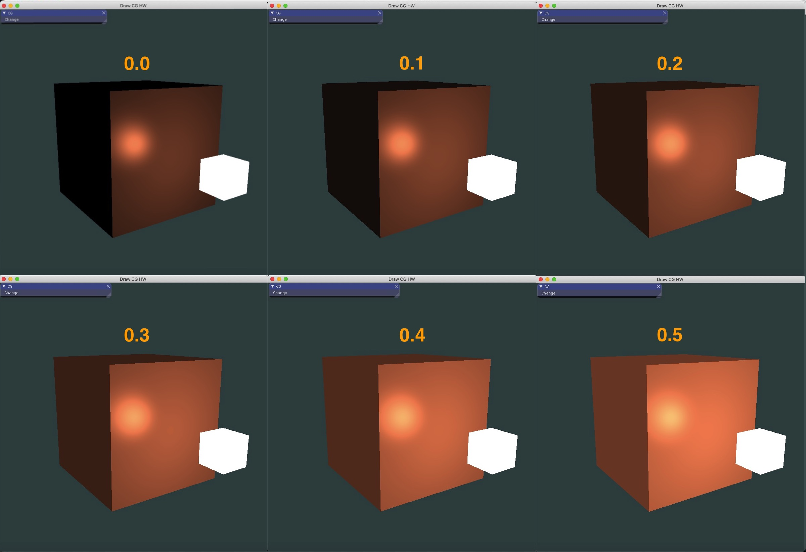
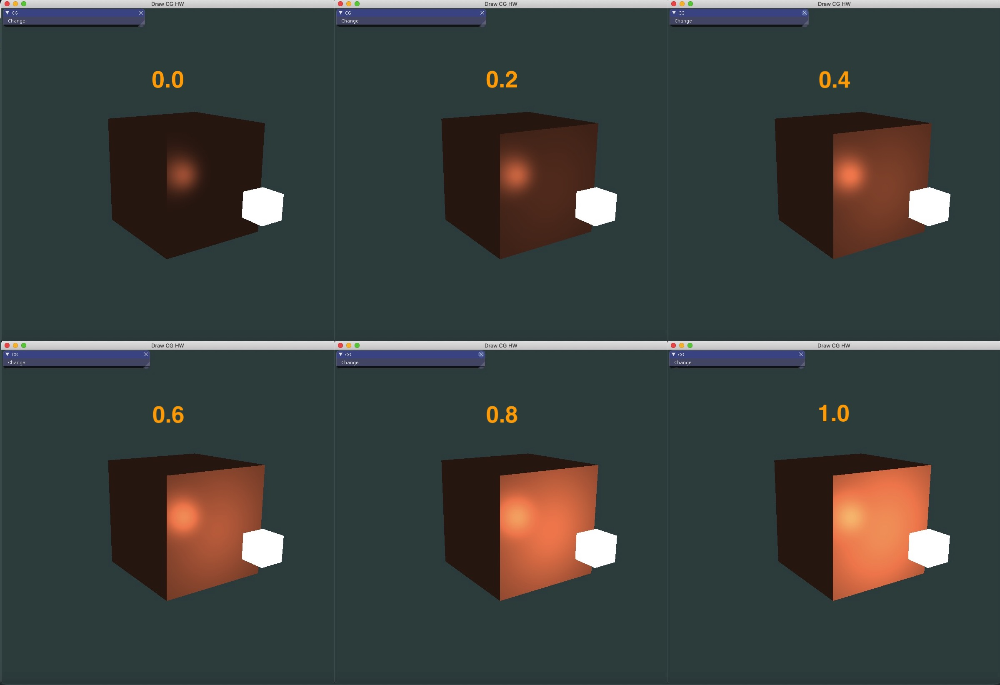
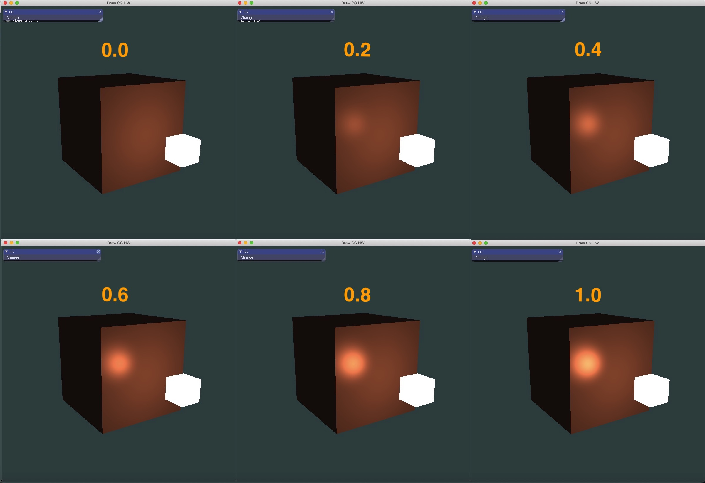
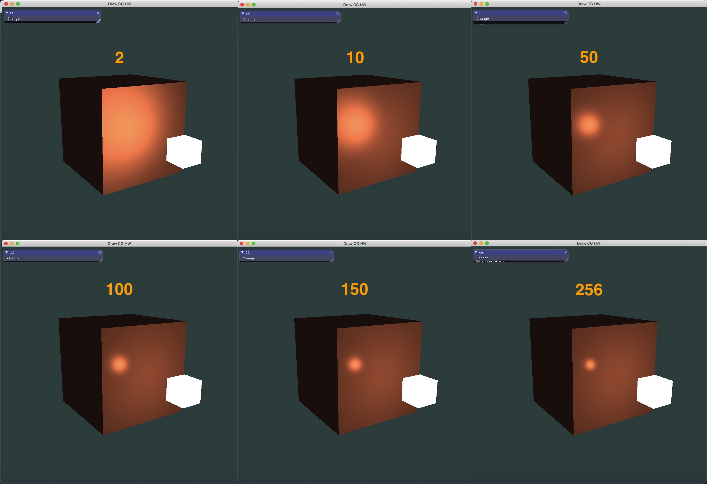
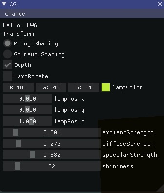

## Homework 

### Basic:
1. 实现Phong光照模型: 
   * 场景中绘制一个cube
   * 自己写shader实现两种shading: Phong Shading 和 Gouraud Shading，并解释两种shading的实现原理 
   * 合理设置视点、光照位置、光照颜色等参数，使光照效果明显显示 

2. 使用GUI，使参数可调节，效果实时更改: 
   * GUI里可以切换两种shading 
   * 使用如进度条这样的控件，使ambient因子、diffuse因子、specular因子、反光度等参数可调节，光照效 果实时更改 

### Bonus: 

* 当前光源为静止状态，尝试使光源在场景中来回移动，光照效果实时更改。 

## Answer

### Basic:

#### Phong Shading

冯氏光照模型的主要结构由3个分量组成：环境(Ambient)、漫反射(Diffuse)和镜面(Specular)光照。

- 环境光照(Ambient Lighting)：即使在黑暗的情况下，世界上通常也仍然有一些光亮（月亮、远处的光），所以物体几乎永远不会是完全黑暗的。为了模拟这个，我们会使用一个环境光照常量，它永远会给物体一些颜色。

  环境光照添加到场景：光的颜色乘以一个很小的常量环境因子，再乘以物体的颜色，然后将最终结果作为片段的颜色。

  ```c++
  vec3 ambient = ambientStrength * lightColor;
  vec3 result = ambient * objectColor;
  FragColor = vec4(result, 1.0);
  ```

- 漫反射光照(Diffuse Lighting)：模拟光源对物体的方向性影响(Directional Impact)。它是冯氏光照模型中视觉上最显著的分量。物体的某一部分越是正对着光源，它就会越亮。

  **法向量**：

  法向量由顶点着色器传递到片段着色器。由于片段着色器里的计算都是在世界空间坐标中进行的，所以在顶点着色器中将输入法向量转换为世界空间坐标输出给片段着色器。

  法线矩阵(Normal Matrix)，它使用了一些线性代数的操作来移除对法向量错误缩放的影响，被定义为「模型矩阵左上角的逆矩阵的转置矩阵」。顶点着色器中，我们可以使用inverse和transpose函数自己生成这个法线矩阵：

  ```c++
  Normal = mat3(transpose(inverse(model))) * aNormal;
  ```

  **计算漫反射光照**：

  计算光源和片段位置之间的方向向量，可以通过让两个向量相减的方式计算。先将所有相关向量转变成单位向量：

  ```c++
  vec3 norm = normalize(Normal);
  vec3 lightDir = normalize(lightPos - FragPos);
  ```

  对norm和lightDir向量进行点乘，再乘以物体漫反射因子，计算光源对当前片段实际的漫反射影响。结果值再乘以光的颜色，得到漫反射分量。	

  ```c++
  float diff = max(dot(norm, lightDir), 0.0);
  vec3 diffuse = diffuseStrength * diff * lightColor;
  ```

  环境光分量和漫反射分量，我们把它们相加，然后把结果乘以物体的颜色，来获得片段最后的输出颜色。

  ```c++
  vec3 result = (ambient + diffuse) * objectColor;
  FragColor = vec4(result, 1.0);
  ```

- 镜面光照(Specular Lighting)：模拟有光泽物体上面出现的亮点。镜面光照的颜色相比于物体的颜色会更倾向于光的颜色。

  计算视线方向向量，和对应的沿着法线轴的反射向量：

  ```c++
  vec3 viewDir = normalize(viewPos - FragPos);
  vec3 reflectDir = reflect(-lightDir, norm);
  ```

  `reflect`函数要求第一个向量是**从**光源指向片段位置的向量，但是`lightDir`当前正好相反，是从片段**指向**光源，所以需要取反方向。第二个参数要求是一个法向量，使用已标准化的`norm`向量。

  再计算视线方向与反射方向的点乘（并确保它不是负值），然后取它的幂方（表示高光的反光度）。

  ```c++
  float spec = pow(max(dot(viewDir, reflectDir), 0.0), shininess);
  vec3 specular = specularStrength * spec * lightColor;
  ```

  将计算结果加到环境光分量和漫反射分量里，再用结果乘以物体的颜色：

  ```c++
  vec3 result = (ambient + diffuse + specular) * objectColor;
  FragColor = vec4(result, 1.0);
  ```

  这就实现了phong shading的所有计算。

##### Phong Shading的顶点着色器：

```c++
#version 330 core
layout (location = 0) in vec3 aPos;
layout (location = 1) in vec3 aNormal;

out vec3 FragPos;
out vec3 Normal;

uniform mat4 model;
uniform mat4 view;
uniform mat4 projection;

void main()
{
    FragPos = vec3(model * vec4(aPos, 1.0));
    Normal = mat3(transpose(inverse(model))) * aNormal;
    
    gl_Position = projection * view * vec4(FragPos, 1.0);
}
```

增加了法向量的计算，将输入法向量标准化，传递给片段着色器用于漫反射光照和镜面反射的计算。

##### Phong Shading的片段着色器：

```c++
#version 330 core
out vec4 FragColor;

in vec3 Normal;
in vec3 FragPos;

uniform vec3 lightPos;
uniform vec3 viewPos;
uniform vec3 lightColor;
uniform vec3 objectColor;

uniform float ambientStrength;
uniform float diffuseStrength;
uniform float specularStrength;
uniform int shininess;

void main()
{
    // ambient
    vec3 ambient = ambientStrength * lightColor;
    
    // diffuse
    vec3 norm = normalize(Normal);
    vec3 lightDir = normalize(lightPos - FragPos);
    float diff = max(dot(norm, lightDir), 0.0);
    vec3 diffuse = diffuseStrength * diff * lightColor;
    
    // specular
    vec3 viewDir = normalize(viewPos - FragPos);
    vec3 reflectDir = reflect(-lightDir, norm);
    float spec = pow(max(dot(viewDir, reflectDir), 0.0), shininess);
    vec3 specular = specularStrength * spec * lightColor;
    
    vec3 result = (ambient + diffuse + specular) * objectColor;
    FragColor = vec4(result, 1.0);
}

```

所有光照（环境光，漫反射，镜面反射）的计算都是在片段着色器里进行。

##### Light类

```c++
class Light {
    
public:
    Light(const unsigned int src_height, const unsigned int src_width);
    void setArgs(ImVec4 lampColor, float ambientStrength, float diffuseStrength, float specularStrength, int shininess);
    void render(Shader &lampShader, Shader &lightingShader, bool depth, Camera camera, float fov);

    void updateLampPos(glm::vec3 lightPos);
    
private:
    int scr_width;
    int scr_height;
    
    ImVec4 lampColor;
    
    float ambientStrength;
    float diffuseStrength;
    float specularStrength;
    int shininess;
    
    float vertices[216] = {
				// 所有顶点的坐标和法向量
    };
    
    glm::vec3 lightPos = glm::vec3(0.0f, 0.0f, 1.0f);
};
```

* 初始化构造函数：传入显示屏幕的宽和高

  ```c++
  Light::Light(const unsigned int src_height, const unsigned int src_width): scr_width(src_width), scr_height(src_height){}
  ```

* `setArgs`函数：更新light对象中等的颜色，和光照渲染需要用到的多个参数值

  ```c++
  void Light::setArgs(ImVec4 lampColor, float ambientStrength, float diffuseStrength, float specularStrength, int shininess){
      this->lampColor = lampColor;
      this->ambientStrength = ambientStrength;
      this->diffuseStrength = diffuseStrength;
      this->specularStrength = specularStrength;
      this->shininess = shininess;
  }
  ```

* `render`函数：渲染图形界面

  vertices数组的前三列设置为顶点坐标属性，后三列设为法向量属性。

  ```c++
  // position attribute
  glVertexAttribPointer(0, 3, GL_FLOAT, GL_FALSE, 6 * sizeof(float), (void*)0);
  glEnableVertexAttribArray(0);
  // normal attribute
  glVertexAttribPointer(1, 3, GL_FLOAT, GL_FALSE, 6 * sizeof(float), (void*)(3 * sizeof(float)));
  glEnableVertexAttribArray(1);
  ```

  设置着色器中的参数值：

  ```c++
  lightingShader.use();
  lightingShader.setVec3("objectColor", 1.0f, 0.5f, 0.31f);
  lightingShader.setVec3("lightColor", lampColor.x, lampColor.y, lampColor.z);
  lightingShader.setVec3("lightPos", lightPos);
  lightingShader.setVec3("viewPos", camera.Position);
  
  lightingShader.setFloat("ambientStrength", ambientStrength);
  lightingShader.setFloat("diffuseStrength", diffuseStrength);
  lightingShader.setFloat("specularStrength", specularStrength);
  lightingShader.setInt("shininess", shininess);
  ```

  绘制cube：

  ```c++
  glm::mat4 projection = glm::perspective(glm::radians(fov), (float)scr_width / (float)scr_width, 0.1f, 100.0f);
  glm::mat4 view = camera.GetViewMatrix();
  lightingShader.setMat4("projection", projection);
  lightingShader.setMat4("view", view);
  
  // world transformation
  glm::mat4 model = glm::mat4(1.0f);
  lightingShader.setMat4("model", model);
  
  // render the cube
  glBindVertexArray(cubeVAO);
  glDrawArrays(GL_TRIANGLES, 0, 36);
  ```

  绘制lamp:

  ```c++
  lampShader.use();
  lampShader.setMat4("projection", projection);
  lampShader.setMat4("view", view);
  model = glm::mat4(1.0f);
  model = glm::translate(model, lightPos);
  model = glm::scale(model, glm::vec3(0.2f)); // a smaller cube
  lampShader.setMat4("model", model);
  
  glBindVertexArray(lightVAO);
  glDrawArrays(GL_TRIANGLES, 0, 36);
  ```

  通过`translate`平移到灯所在的位置。

* `updateLampPos`函数：更新灯的位置

  ```c++
  void Light::updateLampPos(glm::vec3 lightPos){
      this->lightPos = lightPos;
  }
  ```

**问题**：修改顶点或者片段着色器后，灯的位置或颜色也会随之改变。

需要给灯重新定义新的着色器，使灯一直保持明亮，不受其它颜色变化的影响。

* 灯的顶点着色器

  ```c++
  #version 330 core
  layout (location = 0) in vec3 aPos;
  
  uniform mat4 model;
  uniform mat4 view;
  uniform mat4 projection;
  
  void main()
  {
      gl_Position = projection * view * model * vec4(aPos, 1.0);
  }
  ```

  只用定义灯的位置。

* 灯的片段着色器

  ```c++
  #version 330 core
  out vec4 FragColor;
  
  void main()
  {
      FragColor = vec4(1.0); 
  }
  
  ```

  灯的片段着色器给灯定义了一个不变的常量白色，保证了灯的颜色一直是亮的。

##### 显示效果

* ambientStrength
  

* diffuseStrength

  

* specularStrength

  

* shininess

  

#### Gouraud Shading

在顶点着色器中实现的冯氏光照模型叫做Gouraud着色(Gouraud Shading)。

所以只用将phong光照模型片段着色器中的所有光照计算移到顶点着色器中即是Gouraud Shading。

* Gouraud Shading的顶点着色器

  ```c++
  #version 330 core
  layout (location = 0) in vec3 aPos;
  layout (location = 1) in vec3 aNormal;
  
  out vec3 LightingColor; // resulting color from lighting calculations
  
  uniform vec3 lightPos;
  uniform vec3 viewPos;
  uniform vec3 lightColor;
  
  uniform mat4 model;
  uniform mat4 view;
  uniform mat4 projection;
  
  uniform float ambientStrength;
  uniform float diffuseStrength;
  uniform float specularStrength;
  uniform int shininess;
  
  void main()
  {
      gl_Position = projection * view * model * vec4(aPos, 1.0);
      
      // gouraud shading
      // ------------------------
      vec3 Position = vec3(model * vec4(aPos, 1.0));
      vec3 Normal = mat3(transpose(inverse(model))) * aNormal;
      
      // ambient
      vec3 ambient = ambientStrength * lightColor;
      
      // diffuse
      vec3 norm = normalize(Normal);
      vec3 lightDir = normalize(lightPos - Position);
      float diff = max(dot(norm, lightDir), 0.0);
      vec3 diffuse = diffuseStrength * diff * lightColor;
      
      // specular
      vec3 viewDir = normalize(viewPos - Position);
      vec3 reflectDir = reflect(-lightDir, norm);
      float spec = pow(max(dot(viewDir, reflectDir), 0.0), shininess);
      vec3 specular = specularStrength * spec * lightColor;
      
      LightingColor = ambient + diffuse + specular;
  }
  
  ```

* Gouraud Shading的片段着色器

  ```c++
  #version 330 core
  out vec4 FragColor;
  
  in vec3 LightingColor;
  
  uniform vec3 objectColor;
  
  void main()
  {
      FragColor = vec4(LightingColor * objectColor, 1.0);
  }
  
  ```

##### 显示效果

* ambientStrength


* diffuseStrength


* specularStrength & shininess


修改这两个值，光照效果基本没变化。只有当高光落在顶点上时，才会产生变化。

**两种shading方式的比较**：

* Gouraud shading：对顶点进行处理
  * 对每个顶点进行Phong lighting
  * 采用插值亮度的处理
  * 在顶点着色器中计算光照

* Phong shading：对每个像素进行处理
  * 计算顶点的平均法向量
  * 采用插值法向量的处理方法
  * 在片段着色器中计算光照

对于Gouraud shading，如果高光不落在顶点上，将损失高光。

总体来说，Phong shading能产生更平滑的光照效果。

#### GUI设置

```c++
ImGui::Text("Transform");

ImGui::RadioButton("Phong Shading", &chooseItem, 0);  
ImGui::RadioButton("Gouraud Shading", &chooseItem, 1);     

ImGui::Checkbox("Depth", &depth);
ImGui::Checkbox("LampRotate", &LampRotate);

ImGui::ColorEdit3("lampColor", (float*)&lampColor);

ImGui::PushItemWidth(100);
ImGui::SliderFloat("lampPos.x", &lampPos[0], -2.0f, 2.0f);
ImGui::SliderFloat("lampPos.y", &lampPos[1], -2.0f, 2.0f);
ImGui::SliderFloat("lampPos.z", &lampPos[2], -5.0f, 5.0f);

ImGui::PushItemWidth(200);
ImGui::SliderFloat("ambientStrength", &ambientStrength, 0.0f, 2.0f);
ImGui::SliderFloat("diffuseStrength", &diffuseStrength, 0.0f, 2.0f);
ImGui::SliderFloat("specularStrength", &specularStrength, 0.0f, 2.0f);
ImGui::SliderInt("shininess", &shininess, 0, 256);
```

##### 显示界面



可以切换两种shading，调节灯的颜色和位置，调节光照的ambient因子、diffuse因子、specular因子、反光度参数。

### Bonus

**实现光源在场景中移动**

* IMGUI手动设置lamp的位置

  ```c++
  ImGui::SliderFloat("lampPos.x", &lampPos[0], -2.0f, 2.0f);
  ImGui::SliderFloat("lampPos.y", &lampPos[1], -2.0f, 2.0f);
  ImGui::SliderFloat("lampPos.z", &lampPos[2], -5.0f, 5.0f);
  ```

* 可通过将光源位置设置为关于时间的函数实现。

  ```c++
  if(LampRotate){
      lampPos[0] = sin(glfwGetTime()) * 1.0f;
      lampPos[1] = cos(glfwGetTime()) * 1.0f;
      lampPos[2] = sin(glfwGetTime()) * cos(glfwGetTime()) * 2.0f;
  }
  light.updateLampPos(lampPos);
  ```

  再通过调用light的`updateLampPos`函数更新灯的位置。

##### 显示效果


