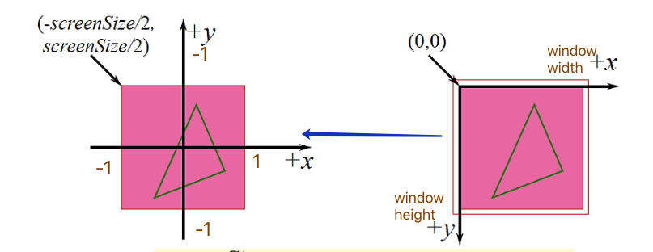
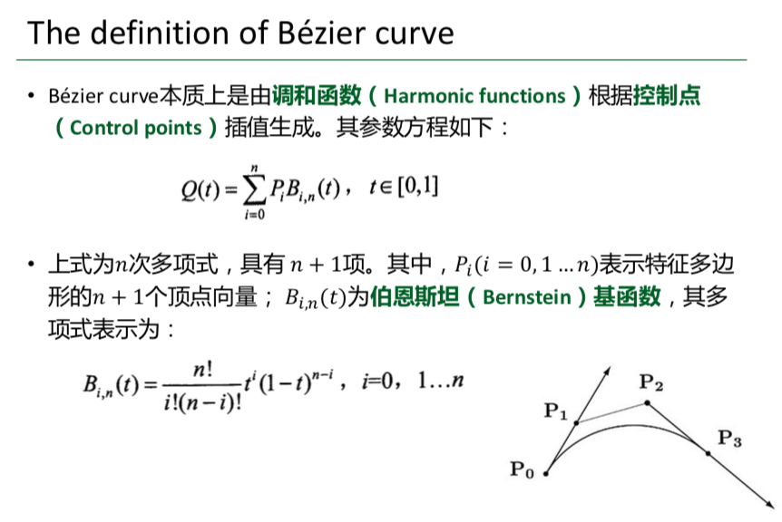
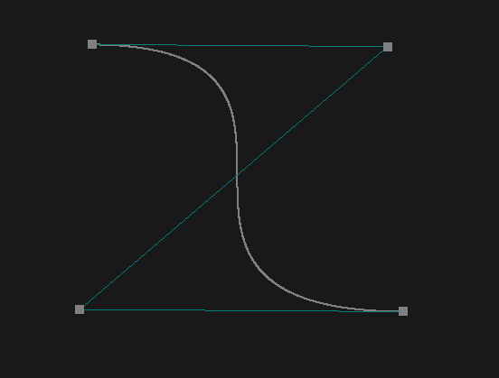

# 【计算机图形学】HW8

## Homework 

### Basic: 

1. 用户能通过左键点击添加Bezier曲线的控制点，右键点击则对当前添加的最后一个控制点进行消除 

2. 工具根据鼠标绘制的控制点实时更新Bezier曲线。 

   Hint: 大家可查询捕捉mouse移动和点击的函数方法 

### Bonus: 

1. 可以动态地呈现Bezier曲线的生成过程。 

## Answer

### Basic

#### 鼠标点击添加或删除控制点

* 鼠标事件回调函数

  ```c++
  GLFWmousebuttonfun glfwSetMouseButtonCallback(GLFWwindow * window, GLFWmousebuttonfun cbfun)	
  ```

  此函数设置指定窗口的鼠标按钮回调，当按下或释放鼠标按钮时调用此回调。

  **Parameters**

  ​		`window`：设置回调窗口

  ​		`cbfun`：新的回调函数，`NULL`表示删除已设置的回调

  **Rutrun**

  ​		前一个设置的回调，`NULL`表示之前未设置回调或者library未被初始化

* 光标位置位置函数

  ```c++
  GLFWcursorposfun glfwSetCursorPosCallback(GLFWwindow * window, GLFWcursorposfun cbfun)	
  ```

  **Parameters**

  ​		`window`：被设置的回调窗口

  ​		`cbfun`：新的回调函数，`NULL`表示删除已设置的回调

  **Returns**

  ​		前一个设置的回调，`NULL`表示之前未设置回调或者library未被初始化


在主函数中添加光标事件和鼠标事件的回调函数：

```c++
glfwSetCursorPosCallback(window, CursorPosCallback);
glfwSetMouseButtonCallback(window, MouseButtonCallback);
```

定义鼠标事件的响应函数：

```c++
void MouseButtonCallback(GLFWwindow* window, int button, int action, int mods){
    change = true;
    if(glfwGetMouseButton(window, GLFW_MOUSE_BUTTON_LEFT) == GLFW_PRESS) {
        if(BezierPos.size() < POS_MAX_SIZE) {
            BezierPos.push_back(CursorPos);
        }
    }
    if(glfwGetKey(window, GLFW_MOUSE_BUTTON_RIGHT) == GLFW_PRESS) {
        for(auto it = BezierPos.begin(); it != BezierPos.end() ; it++) {
            if(pow(it->x - CursorPos.x, 2) + pow(it->y - CursorPos.y, 2) <= 0.01) {
                BezierPos.erase(it);
                break;
            }
        }
    }
}
```

* 鼠标左键被识别，且控制点数小于最大允许数`POS_MAX_SIZE`时，添加鼠标位置(鼠标位置需转换坐标系得到)。

* 鼠标右键被识别，删除鼠标所在位置周围小范围内的点，涉及到点与点之间距离的计算。

定义光标位置事件响应函数：

```c++
void CursorPosCallback(GLFWwindow* window, double xpos, double ypos)
{
    CursorPos.x = (xpos - WINDOW_WIDTH/2)/(WINDOW_WIDTH/2);
    CursorPos.y = (WINDOW_HEIGHT/2 - ypos)/(WINDOW_HEIGHT/2);
  
 		   ···		
}
```

在原有基础上添加鼠标位置坐标系转换，将光标坐标由屏幕坐标系（下图右）转成窗口坐标系（下图左）坐标。



#### 渲染

**顶点着色器**

```c++
#version 410 core
layout (location = 0) in vec2 aPos;

void main()
{
    gl_Position = vec4(aPos,0.0, 1.0);
}
```

2D平面顶点只需要`x,y`坐标。

**片段着色器**

```c++
#version 410 core
out vec4 FragColor;
uniform vec3 ourColor;

void main()
{
    FragColor = vec4(ourColor, 1.0f);
}
```

定义`uniform`全局类型参数`ourColor`，无需通过顶点着色器作为中介。

* 控制点的渲染

  ```c++
  void BezierCurve::updateVertices(Shader & ourShader,vector<glm::vec2> BezierPos){
      PointCount=BezierPos.size();
      
      for (int i = 0; i < BezierPos.size(); i++) {
          vertices[i * 2] = BezierPos[i].x;
          vertices[i * 2 + 1] = BezierPos[i].y;
      }
      unsigned int VBO, VAO;
      glGenVertexArrays(1, &VAO);
      glGenBuffers(1, &VBO);
      
      glBindVertexArray(VAO);
      glBindBuffer(GL_ARRAY_BUFFER, VBO);
      glBufferData(GL_ARRAY_BUFFER, sizeof(vertices), vertices, GL_STATIC_DRAW);
      
      //坐标属性
      glVertexAttribPointer(0, 2, GL_FLOAT, GL_FALSE, 2 * sizeof(float), (void*)0);
      glEnableVertexAttribArray(0);
      
      glBindBuffer(GL_ARRAY_BUFFER, 0);
      glBindVertexArray(0);
      
      ourShader.use();
      glBindVertexArray(VAO);
      
      ourShader.setVec3("ourColor", glm::vec3(0.5,0.5,0.5));
      glPointSize(10.0f);
      glDrawArrays(GL_POINTS, 0, PointCount);
      
      ···
  }
  ```

  根据输入`BezierPos`更新vertices数组，设置顶点的位置属性， `ourShader.setVec3`设置颜色，` glDrawArrays(GL_POINTS, 0, PointCount)`渲染显示。

* 辅助线的渲染

  ```c++
  void BezierCurve::updateVertices(Shader & ourShader,vector<glm::vec2> BezierPos){
  		
    	···
      
      ourShader.setVec3("ourColor", glm::vec3(0.0,0.5,0.5));
      glLineWidth(5.0f);
      glDrawArrays(GL_LINE_STRIP, 0, PointCount);
  		
    	···
  }
  ```

  同样根据`vertices`数组渲染辅助线。

* Bezier曲线渲染

  

  **Bernstein基函数**

  ```c++
  int Factorial(int n) {
      if (n == 0) return 1;
      int result = 1;
      for (int i = 1; i <= n; i++) {
          result *= i;
      }
      return result;
  }
  float getBernstein(int i, int n, float t) {
      return Factorial(n) / (Factorial(i) * Factorial(n - i)) * pow(t, i) * pow(1 - t, n - i);
  }
  ```

  **调和函数参数方程**

  ```c++
  for (float t = 0; t < 1; t += 0.001) {
      float c_x = 0, c_y = 0;
      for (int i = 0; i < PointCount; i++) {
          float bernstein = getBernstein(i, PointCount-1, t);
          c_x += BezierPos[i].x * bernstein;
          c_y += BezierPos[i].y * bernstein;
      }
      curve[CurveCount * 2] = c_x;
      curve[CurveCount * 2 + 1] = c_y;
      CurveCount++;
  }
  ```

  `curve`数组存储所有插值点，t从0到1就生成了Bezier曲线上所有的样本插值点。

  ```c++
  glGenVertexArrays(1, &VAO);
  glGenBuffers(1, &VBO);
  
  glBindVertexArray(VAO);
  glBindBuffer(GL_ARRAY_BUFFER, VBO);
  glBufferData(GL_ARRAY_BUFFER, sizeof(curve), curve, GL_STATIC_DRAW);
  
  //坐标属性
  glVertexAttribPointer(0, 2, GL_FLOAT, GL_FALSE, 2 * sizeof(float), (void*)0);
  glEnableVertexAttribArray(0);
  
  glBindBuffer(GL_ARRAY_BUFFER, 0);
  glBindVertexArray(0);
  
  ourShader.use();
  glBindVertexArray(VAO);
  
  ourShader.setVec3("ourColor", glm::vec3(0.5,0.5,0.5));
  glPointSize(2.0f);
  glDrawArrays(GL_POINTS, 0, CurveCount);
  ```

  同样将curve数组所有顶点渲染输出。按线输出的效果更好，但是按点输出更简单，但是根据t的步长过大可能离散化明显。

  

#### Bonus

**Bezier曲线生成过程算法**

线段$P^k_iP^k_{i+1}$上点的参数方程：$P^{k+1}_i=tP^k_i+(1-t)P^k_{i+1}$

Bezier曲线的生成过程需要用到递归计算：

1. 初始：所有n个控制顶点$P^0_1\cdots P^0_n$，按顺序依次连接，得到n-1条直线$P^0_1P^0_{2},P^0_2P^0_{3},\cdots,P^0_{n-1}P^0_{n}$。

2. 取上一层所有直线$P^k_1P^k_{2},P^k_2P^k_{3},\cdots,P^k_{n-k-1}P^k_{n-k}$上的参数点$P_1^{k+1}\cdots P_{n-k-1}^{k+1}$，按顺序依次连接，得到n-k-1条直线$P_1^{k+1}P_{2}^{k+1},P_2^{k+1}P_{3}^{k+1},\cdots,P_{n-1}^{k+1}P_{n}^{k+1}$。

   ```c++
   for (int i = 0; i < leftPos - 1; i++) {
       float px = tempVertices[i*2] * (1 - tStrength) + tempVertices[i*2+2] * tStrength;
       float py =tempVertices[i*2+1] * (1 - tStrength) + tempVertices[i*2+3] * tStrength;
       lineVertex[newCount*2] = px;
       lineVertex[newCount*2+1] = py;
       newCount++;
   }
   ```

3. 结束：当只剩下一个顶点是跳出循环。每经过一层少一个顶点，所以需要n-1次循环。

**算法完整实现**：

```c++
tStrength += 0.005;
if (tStrength > 1)
    tStrength = 0;

int leftPos = PointCount;
for (int i = 0; i < PointCount * 2; i++) {
    tempVertices[i] = vertices[i];
}
while (leftPos > 1) {
    int newCount = 0;

    for (int i = 0; i < leftPos - 1; i++) {
        float px = tempVertices[i*2] * (1 - tStrength) + tempVertices[i*2+2] * tStrength;
        float py =tempVertices[i*2+1] * (1 - tStrength) + tempVertices[i*2+3] * tStrength;
        lineVertex[newCount*2] = px;
        lineVertex[newCount*2+1] = py;
        newCount++;
    }
    drawLine(ourShader, newCount);
    for (int i = 0; i < newCount * 2; i++) {
        tempVertices[i] = lineVertex[i];
    }

    leftPos = newCount;
}
```

`tempVertices`记录上层所有顶点，`lineVertex`记录新一层的所有顶点。

按层渲染线段组，每轮迭代都调用`drawLine(ourShader, newCount)`将`linevertex`数组中顶点按线段渲染显示。

```c++
void BezierCurve::drawLine(Shader & ourShader, int PosCount){

    unsigned int VBO, VAO;
    glGenVertexArrays(1, &VAO);
    glGenBuffers(1, &VBO);
    
    glBindVertexArray(VAO);
    glBindBuffer(GL_ARRAY_BUFFER, VBO);
    glBufferData(GL_ARRAY_BUFFER, sizeof(lineVertex), lineVertex, GL_STATIC_DRAW);
    
    //坐标属性
    glVertexAttribPointer(0, 2, GL_FLOAT, GL_FALSE, 2 * sizeof(float), (void*)0);
    glEnableVertexAttribArray(0);
    
    glBindBuffer(GL_ARRAY_BUFFER, 0);
    glBindVertexArray(0);
    
    ourShader.use();
    glBindVertexArray(VAO);
    
    ourShader.setVec3("ourColor", glm::vec3(0.0,0.5,0.5));
    glLineWidth(2.0f);
    glDrawArrays(GL_LINE_STRIP, 0, PosCount);
}
```

用键盘R键触发曲线生成过程显示：

```c++
if (glfwGetKey(window, GLFW_KEY_R) == GLFW_PRESS)
    isRun = !isRun;
```

**渲染显示**：


